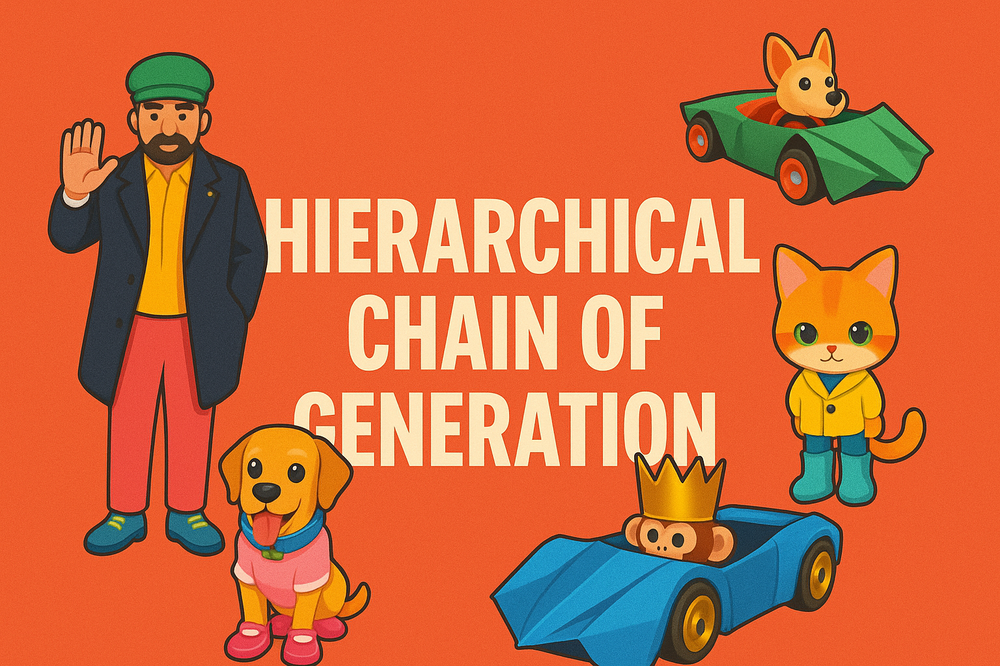
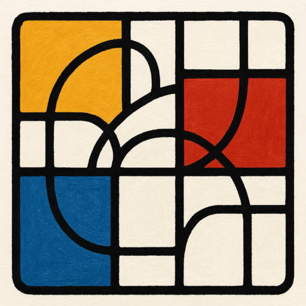

# HCoG: Apply Hierarchical-Chain-of-Generation to Complex Attributes Text-to-3D Generation (CVPR 2025)

<div style="text-align: center;">
    <a href='https://hierarchical-chain-of-generation.github.io/'></a>
    <a href='https://arxiv.org/abs/2505.05505'></a>
</div>

---

This is the version of HCoG method + Stable Diffusion v3. The code is tested on `A100`, `Python 3.11`, `torch 2.4.1` and `CUDA 12.4`.

Another version of HCoG + GALA3D is in this [repo](https://github.com/Wakals/GASCOL/tree/main), which is tested on `RTX3090` with `Python 3.8`, `torch 2.0.0` and `CUDA 11.8`.

<div style="text-align: center;">
    
</div>

##  Overview

Recent text-to-3D generation models have demonstrated remarkable abilities in producing high-quality 3D assets. Despite their great advancements, current models struggle to generate satisfying 3D objects with complex attributes. The difficulty for such complex attributes 3D generation arises from two aspects: (1) existing text-to-3D approaches typically lift text-to-image models to extract semantics via text encoders, while the text encoder exhibits limited comprehension ability for long descriptions, leading to deviated cross-attention focus, subsequently wrong attribute binding in generated results. (2) Objects with complex attributes often exhibit occlusion relationships between different parts, which demands a reasonable generation order as well as explicit disentanglement of different parts to enable structural coherent and attribute following results. Though some works introduce manual efforts to alleviate the above issues, their quality is unstable and highly reliant on manual information. To tackle above problems, we propose a automated method Hierarchical-Chain-of-Generation (HCoG). It leverages a large language model to analyze the long description, decomposes it into several blocks representing different object parts, and organizes an optimal generation order from in to out according to the occlusion relationship between parts, turning the whole generation process into a hierarchical chain. For optimization within each block, we first generate the necessary components coarsely, then bind their attributes precisely by target region localization and corresponding 3D Gaussian kernel optimization. For optimization between blocks, we introduce Gaussian Extension and Label Elimination to seamlessly generate new parts by extending new Gaussian kernels, re-assigning semantic labels, and eliminating unnecessary kernels, ensuring that only relevant parts are added without disrupting previously optimized parts. Experiments validate HCoG's effectiveness in handling complex attributes 3D assets and witnesses high-quality results.

## 🔨 Install the requirements

The requirements is heavily based on [Threestudio](https://github.com/threestudio-project/threestudio).
```
pip install torch==2.4.1 torchvision==0.19.1 torchaudio==2.4.1 --index-url https://download.pytorch.org/whl/cu124
pip install ninja
pip install openai==0.28.0
pip install -r requirements.txt
pip install -U git+https://github.com/luca-medeiros/lang-segment-anything.git

cd custom
git clone https://github.com/Wakals/HCoG_SD3.git
mv HCoG_SD3 threestudio-hcog
cd threestudio-hcog

git clone --recursive https://github.com/Wakals/GASCOL-diff-gaussian-rasterization.git
mv GASCOL-diff-gaussian-rasterization diff-gaussian-rasterization      
pip install ./diff-gaussian-rasterization

pip install ./simple-knn

pip install open3d
pip install pymeshlab
```

## 🤖 Configure OpenAI's API key

Our code is constructed on the version of `openai==0.28.0`, and the code to call the API can be found in [./threestudio/gpt/PE.py](./threestudio/gpt/PE.py). You should get your api key from [OpenAI API Platform](https://platform.openai.com/api-keys), putting it at L12 in [PE.py](./threestudio/gpt/PE.py) and api base website at L63 in [PE.py](./threestudio/gpt/PE.py).

If you have difficulty of getting api key. You can check the example in [PE.py](./threestudio/gpt/PE.py) and use your convenient large model to get a generation order and fill it in according to the format.

## 🖥️ Run the example

For recreating the example, we provide the following command:
```
python launch.py --config custom/threestudio-hcog/configs/hcog.yaml  --train --gpu 0 system.prompt_processor.prompt="a man in black coat, yellow shirt inside, green hat, blue shoes, and pink trousers is waving" system.geometry.geometry_convert_from="shap-e:a man in shirt, trousers and shoes is waving"
```

In order to fine-tune the generated results, you can adjust the parameters in `./custom/threestudio-hcog/configs/hcog.yaml`. For example, you can adjust the `guidance_scale` to generate different smoothness results. Large `guidance_scale` performs fine-grained and low performs smooth. Besides, you can pay attention to the init prompt `system.geometry.geometry_convert_from` of shap-e, because it does have some influence on the final results.

## 📊 Evaluate the results

To evaluate the results generated above, follow [T2I-CompBench](https://github.com/Karine-Huang/T2I-CompBench) to establish the dependencies, and run:
```
# calculate clip socre
pip install clip-score
bash eval_clip_score.sh

# calculate BLIP-VQA score
bash eval_BLIP_VQA_score.sh
```
The results will be found under the dir of `./eval_outputs`.

## 📝 BibTeX

```
@inproceedings{Qin2025ApplyHT,
  title={Apply Hierarchical-Chain-of-Generation to Complex Attributes Text-to-3D Generation},
  author={Yiming Qin and Zhu Xu and Yang Liu},
  year={2025},
  url={https://api.semanticscholar.org/CorpusID:278481349}
}
```